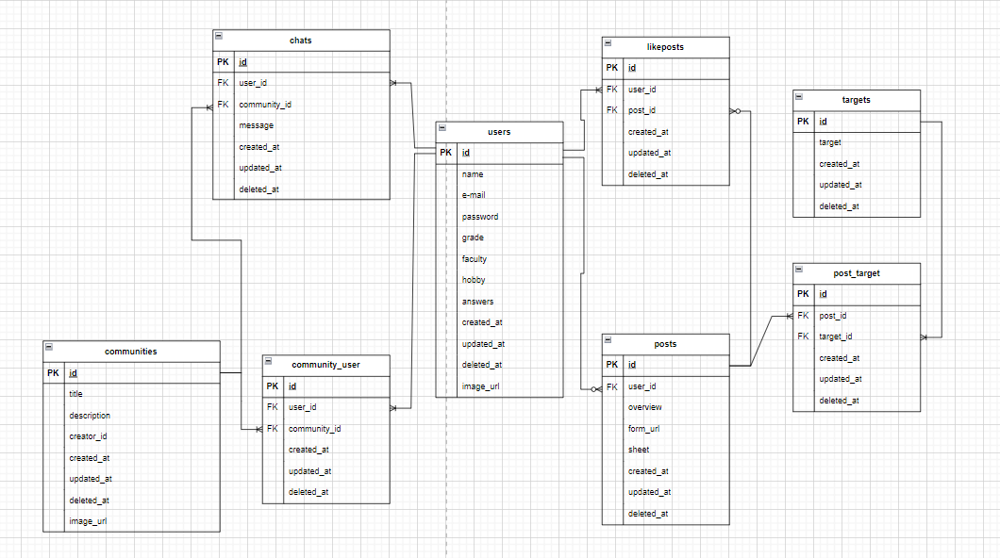

# Reponity

Reponityは、レポートを書くためにアンケートを収集したいという同じ目的をもった人のためのコミュニティアプリです。


## 作成背景

現在、学生がレポートや論文でアンケートを収集するとなるとSNSでアンケート収集をすることが多いですが、
友人に見られるのが恥ずかしかったり、被調査者（回答者）を集めるのが難しかったりするという課題がありました。
そこで、**同じ目的をもつ人のコミュニティであれば恥ずかしくない上に回答率の向上**が期待できるのではないかと考えました。

## 特徴

- **ログイン機能**:ログイン・ログアウトができます。
- **プロフィール機能**:プロフィールの編集・閲覧ができます。
- **アンケート募集投稿機能**:Google Formや概要を投稿できます。
- **いいね機能**:アンケート投稿にお気に入り登録ができます。
- **投稿の絞りこみ機能**:学年で投稿を絞りこむことができます。
- **回答数のカウント機能**:回答後にボタンを押すとカウントされます。
- **集計結果可視化の機能**:スプレッドシートのURLを登録するとアンケート結果が自動で可視化されます。
- **コミュニティ機能**: コミュニティの作成や編集、参加、脱退ができます。
- **リアルタイムチャット機能**:コミュニティ内でリアルタイムチャットができます。
- **論文検索機能**: キーワードで既存の論文を検索することができます。
- **レスポンシブデザイン**: モバイルやPCなど、さまざまなデバイスに対応したデザイン。

### 注力した部分
- **集計結果可視化の機能**<br>
スプレッドシートのURLから正規表現でIDを取得し、Sheets APIとChart.jsを使って自動で可視化しています。
投稿の編集ページからスプレッドシートのURLを設定し、"check"ボタンを押すとグラフを見ることができます。

## アプリURL
[https://reponity-6a74f1455ef5.herokuapp.com/](https://reponity-6a74f1455ef5.herokuapp.com/)
<br>*現在は公開していません。
<br><テストユーザーアカウント>
<br>Email: example@ex.com
<br>password: testexample 


## システム要件

- **PHP**: 8.0以上
- **Laravel**: 10.x
- **MySQL**: 5.7以上
- **Node.js**: 16.x
- **Composer**: 最新バージョン
- **npm**: 最新バージョン

## 使用技術
- **フレームワーク**: Laravel 10.x
- **フロントエンド**: Tailwind CSS, Chart.js
- **ビルドツール**: Vite
- **データベース**: MariaDB
- **リアルタイム通信**: Laravel Echo, Pusher.js
- **認証システム**: Laravel Breeze
- **画像アップロード**: Cloudinary
- **API**: Cinii API, Google Sheets API

## ER図


## セットアップ
以下の手順に従って、Reponityをローカル環境にセットアップします。

### 1. リポジトリのクローン
```
git clone https://github.com/youxi720/reponity_app
cd reponity
```

### 2. 環境設定ファイルのコピー
```
cp .env.example .env
```
必要に応じて.envファイルを編集し、データベースやAPIキーなどの情報を設定します。

### 3. Composerパッケージのインストール
```
composer install
```
### 4. npmパッケージのインストール
```
npm install
```

### 5. アプリケーションキーの生成
```
php artisan key:generate
```

### 6. マイグレーションの実行
```
php artisan migrate
```

### 7. ローカルサーバーの起動
```
php artisan serve
```
これで、http://localhost:8000 にアクセスできるようになります。
